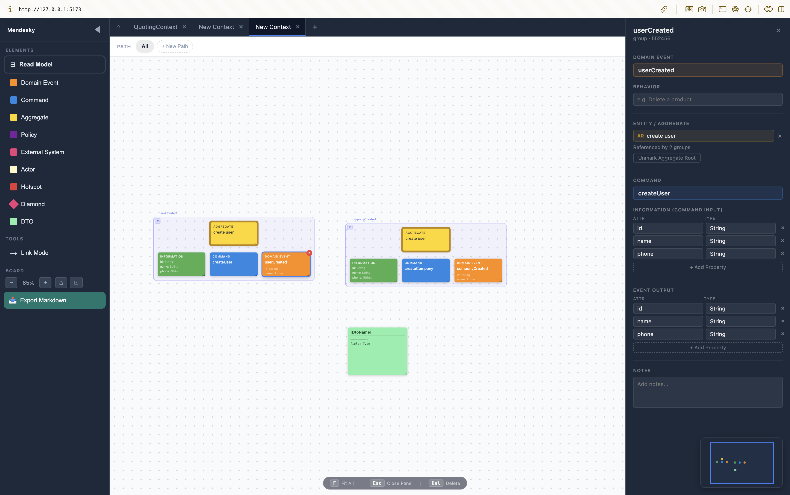
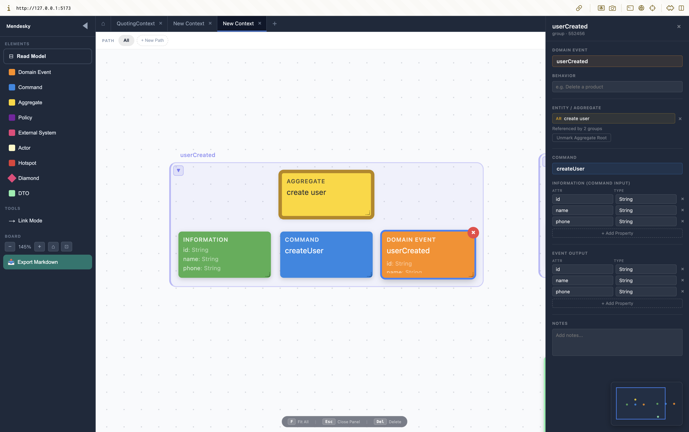
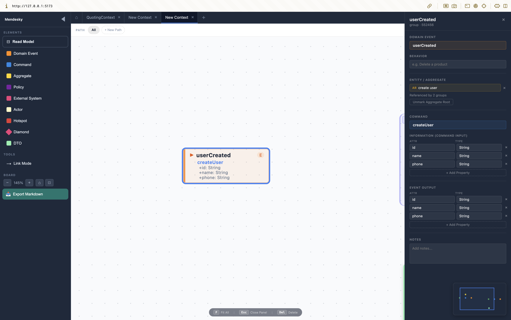
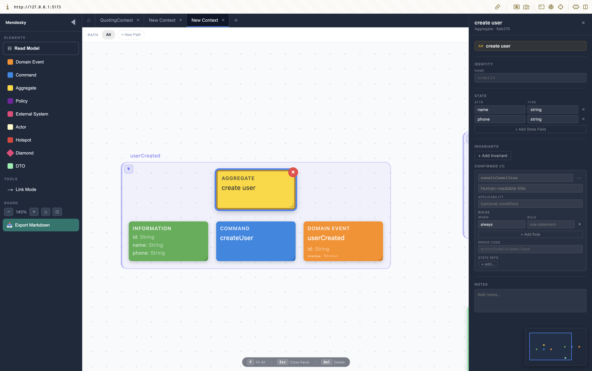
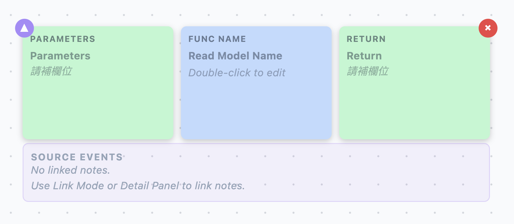
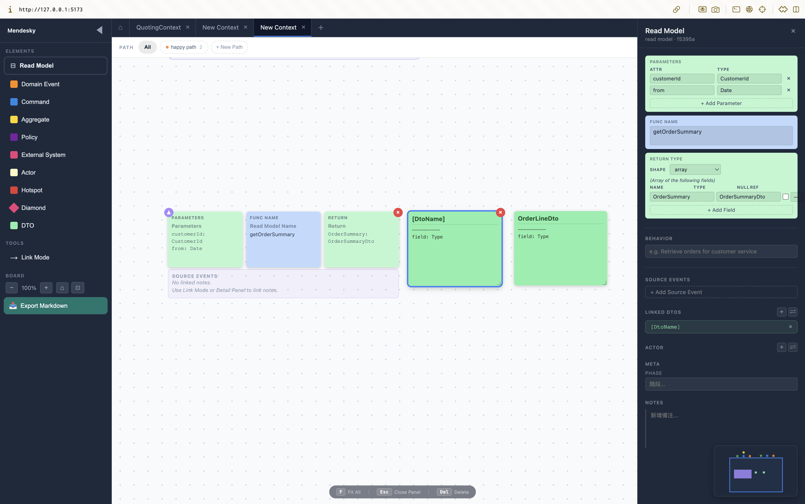
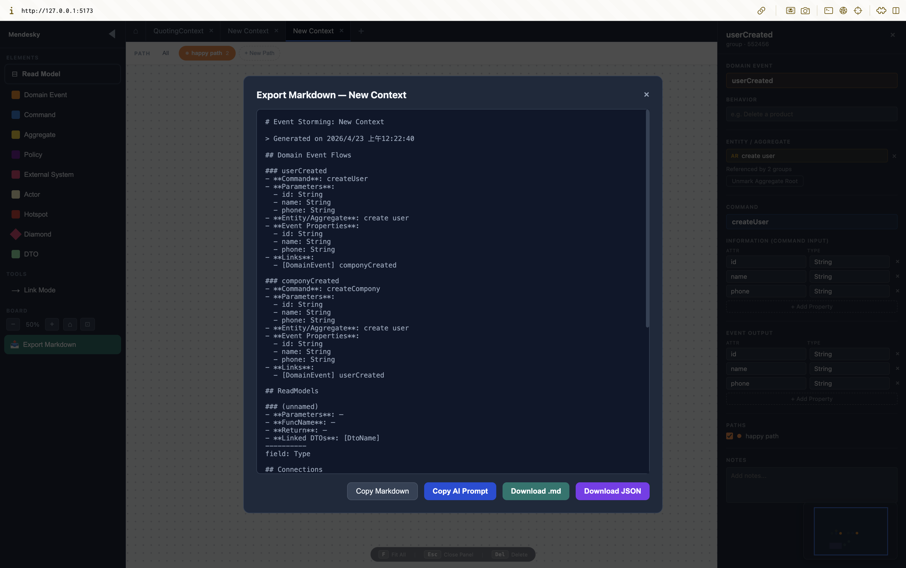
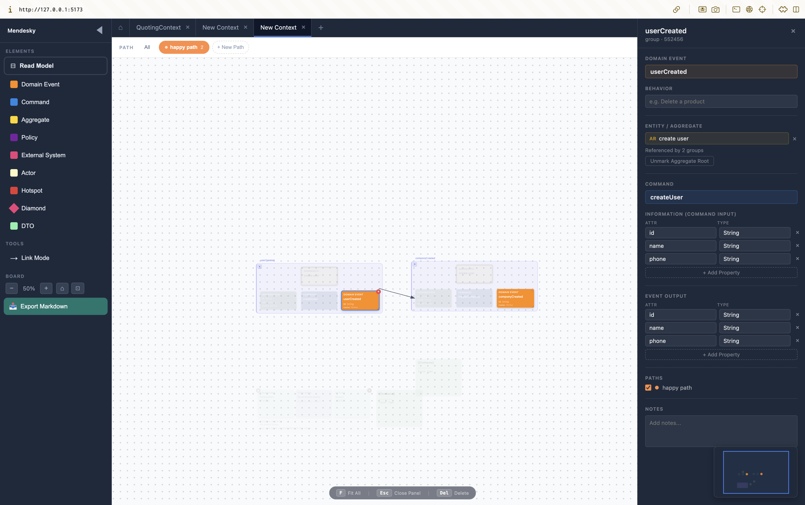
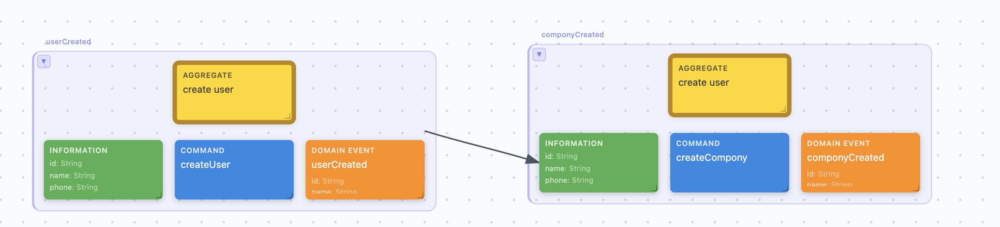
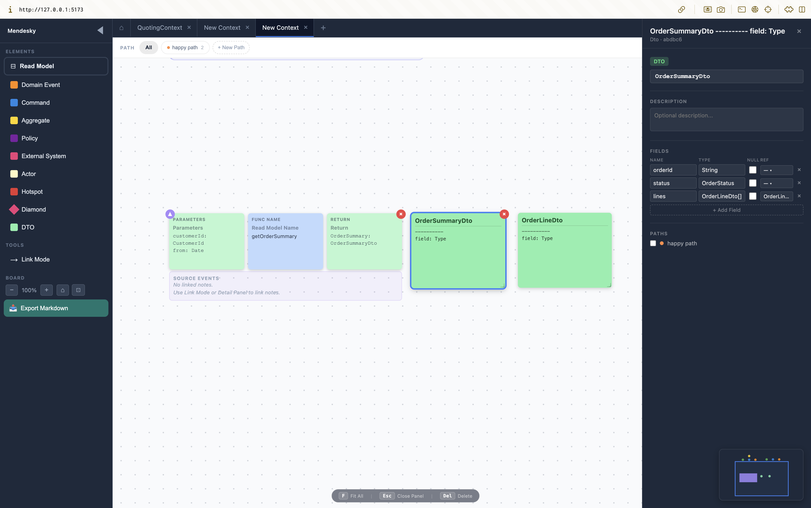

**English** | [繁體中文](README.zh-TW.md)

# Cosmogony

> Every software system is a universe being born.

We don't just write code — we bring a universe into existence. Each domain has its own laws of physics: invariants that must hold, rules that cannot be broken, and boundaries that define where one world ends and another begins.

Event Storming is the act of cosmogony itself — the process by which we observe the primordial chaos of business requirements and discover the fundamental forces that give them structure. Events are the elementary particles. Commands are the forces that act upon them. Aggregates are the celestial bodies that emerge when those particles coalesce under the gravity of business rules.

Just as the universe was not designed but emerged from a set of initial conditions and fundamental laws, a well-modeled domain is not invented — it is discovered. Cosmogony is the tool for that discovery.



---

An **Event Storming whiteboard tool** for **Domain Experts** and **AI** to collaborate on. It supports humans drawing Event Storming diagrams on a canvas, and also lets AI manipulate the canvas directly through MCP tools. Diagrams can finally be exported as a **Spec Bundle** (JSON) that AI can consume to produce executable code.

---

## Table of Contents

- [1. Project Goals](#1-project-goals)
- [2. Core Concepts](#2-core-concepts)
  - [2.1 DomainEvent-Centric Design](#21-domainevent-centric-design)
  - [2.2 Aggregate and Invariant](#22-aggregate-and-invariant)
  - [2.3 Read Model](#23-read-model)
  - [2.4 Spec Bundle Export](#24-spec-bundle-export)
- [3. 12 Element Types](#3-12-element-types)
- [4. Architecture](#4-architecture)
- [5. Quick Start](#5-quick-start)
- [6. Key Features](#6-key-features)
- [7. Documentation Index](#7-documentation-index)

---

## 1. Project Goals

**Event Storming** is a visual collaboration method for exploring complex business domains. By placing sticky notes, domain experts and engineers jointly figure out:

- **What happened** (DomainEvent)
- **Who triggered it** (Actor / Command)
- **Which entity handles it** (Entity / Aggregate)
- **What rules apply** (Policy / Invariant)

What makes this tool different:

1. **Not only for humans** — AI (Claude) can manipulate the canvas directly through the **MCP** protocol
2. **Exportable as structured Spec** — AI can read it and produce executable DDD/CQRS code
3. **Lightweight workshop spirit** — does not force users to fill in too many fields, supports progressive refinement

**Who is it for?**
- Domain Experts: clarify business processes, align with engineers
- Architects / senior engineers: do DDD modeling
- AI agents (Claude): auto-model or assist implementation

---

## 2. Core Concepts

### 2.1 DomainEvent-Centric Design

In traditional Event Storming, Command, Event, and Entity are usually independent sticky notes. This tool uses a group design **anchored on DomainEvent**:

```
DomainEvent (orange)              ← Group anchor
  ├── commandId → Command (blue)
  │                └── informationForCommandId → Information (green)
  └── entityId  → Entity (yellow) or Aggregate (gold border)
```

- **DomainEvent is the group anchor** — dragging it moves the whole group together
- **Command / Information / Entity are satellite notes**, carrying `groupEventId` pointing to the parent DomainEvent
- **Collapsible into a Chip**: when the canvas gets crowded, the entire group can collapse into a 40px orange mini-card

**Expanded Group:**



**Collapsed Chip:**



> 💡 **Why this design?**
> The original 4-in-1 Bundle card locked four cells together, but in practice Command and Entity are shared across multiple DomainEvents. After switching to DomainEvent-Centric, the same Entity can be referenced by multiple DomainEvents, and Commands can be reused.

---

### 2.2 Aggregate and Invariant

**Aggregate** is the "consistency boundary" in DDD, responsible for protecting business rules from being violated.

In this tool:
- **Once an Entity is marked as Aggregate Root**, the note **transforms directly into an Aggregate** (no new note is created)
- Aggregate has a gold border + an `AR` badge in the upper-right corner
- Multiple DomainEvents can share the same Aggregate via `entityId`

**Aggregate Detail Panel** lets you define the full spec:



#### Aggregate Spec Fields

- **Identity**: the Aggregate's identity field (e.g. `orderId`), with a derived type suggestion (`OrderId`)
- **State**: list of properties held by the Aggregate (name / type / required)
- **Invariants**: business invariants (rules), grouped into three visual bands:
  - **CONFIRMED**: rules explicitly authored by the user (solid border, no fill)
  - **NEEDS REVIEW · AI-inferred**: candidate rules inferred by AI (dashed border, light yellow fill)
    - Each card carries `source.agent` / `source.rationale` (origin and reasoning)
    - Comes with three actions: `Approve` / `Edit` / `Reject`
  - **Rejected**: rejected rules (gray strikethrough, collapsible)

#### Full Invariant Structure

Each invariant contains:
- `name`: semantic identifier (camelCase, e.g. `checkCancellable`), maps to the generated method name
- `title`: human-readable label (e.g. "Shipped orders cannot be cancelled")
- `applicability`: when this rule applies (optional, e.g. `customerStatus == .established`)
- `rules`: **multiple conditional rules**, each with `when` + `rule`
  - `when`: condition (e.g. `status == .shipped`, or reserved keyword `always` / `never`)
  - `rule`: the behavior or state when violated (natural language or expression)
- `errorCode`: error identifier when violated (e.g. `orderAlreadyShipped`)
- `relatedState`: which state fields this rule touches

> 💡 **Why is Invariant so complex?**
> Because AI needs this information to produce stable code: `name` → method name, `applicability` → guard condition, `rules[].when` → if/switch branches, `errorCode` → which error to throw. Without these, AI generates different code every time.

---

### 2.3 Read Model

**Read Model** represents the Query side of CQRS — describing "how to query data", separated from the Command side (Aggregate).

It is rendered on the canvas as a **4-in-1 card**:



Three colored cells:

| Cell | Color | Meaning | Example |
|------|------|------|-----|
| Left (Parameters) | Mint green | Query parameters | `customerId: CustomerId, from: Date` |
| Middle (Func Name) | Blue-gray | Query function name | `getOrderSummary` |
| Right (Return Type) | Mint green | Return data structure | `OrderSummaryDto[]` |

**Detail Panel** uses a structured editor (not plain text):



- **Parameters**: table editor (name / type / required)
- **Return Type**:
  - `shape`: dropdown (object / array / primitive)
  - `fields`: each field has name / type / nullable / **dtoSpecRef** (can reference a Dto)
- The sub-note content on the canvas is **auto-generated from the structured data** (edit a field → canvas updates live)

#### Source Events (optional)

A Read Model can be linked to DomainEvents, indicating "data is projected from these events". Expand the Source Events section to manage them.

---

### 2.4 Spec Bundle Export

The end goal of the tool is to produce a **Spec Bundle**: a JSON document AI can consume to produce executable DDD/CQRS code.



Two formats are supported:
- **Markdown**: for humans to review (sections include DomainEvents / ReadModels / FlowPaths)
- **JSON**: for AI to process (structured, includes derived fields)

### Bundle Structure

```json
{
  "manifestVersion": 1,
  "bundleId": "...",
  "context": "OrderManagement",
  "aggregates":  [AggregateSpec, ...],
  "useCases":    [UseCaseSpec,   ...],
  "readModels":  [ReadModelSpec, ...],
  "dtos":        [DtoSpec,       ...]
}
```

### Four Spec Types

| Spec Type | DDD Concept | Question Answered |
|-----------|------------|-------------|
| **AggregateSpec** | Aggregate (consistency boundary) | What state does this Aggregate hold? What invariants? |
| **UseCaseSpec** | Command + DomainEvent | Who initiates the action? What is the input? What event is produced? |
| **ReadModelSpec** | Query / Projection | What data to query? What input/output format? |
| **DtoSpec** | Data Transfer Object | What does the data structure look like? |

### Authored vs Derived (`_suggested_` prefix)

To prevent AI from treating derived fields as user-asserted facts, every **name-derived** field in the Spec is prefixed with `_suggested_`:

```json
{
  "aggregate": "Order",                      // ✅ Authored by the user, AI must trust
  "_suggested_aggregateId": "OrderId",       // ⚠️ Naming derivation hint, AI may adjust per framework
  "_suggested_method": "Order.cancel",       // ⚠️ Same as above
  "_suggested_repository": "OrderRepository" // ⚠️ Same as above
}
```

> 📖 **Full Spec specification**: [`docs/spec-design.md`](docs/spec-design.md)
> 📖 **Design rationale FAQ**: [`docs/spec-design-explanation.md`](docs/spec-design-explanation.md)

---

## 3. 12 Element Types

| Type | Color | Description |
|------|------|------|
| `DomainEvent` | orange | A domain event that has happened (group anchor) |
| `Command` | blue | User intent / command (satellite note) |
| `Information` | green | Input parameters of a Command (satellite note) |
| `Entity` | yellow | The entity being operated on (satellite note) |
| `Aggregate` | gold border | Aggregate Root (transformed from a marked Entity) |
| `Actor` | light yellow | User / external role |
| `Policy` | purple | Business rule / policy |
| `ExternalSystem` | pink | External system |
| `ReadModel` | dark green | Query view (legacy, replaced by Remodel 4-in-1) |
| `Hotspot` | red | Issue point that needs discussion |
| `Diamond` | pink | Decision diamond |
| `Dto` | light green | Data transfer object (supports structured field definitions) |

---

## 4. Architecture

### Frontend — React + TypeScript (Vite)

- **React** + **TypeScript**: component-based architecture, types flow through the whole project
- **Vite**: lightning-fast HMR
- **Zustand + immer**: state management with `persist` middleware (localStorage, currently v14) and version migration
- **dnd-kit**: drag-and-drop sorting

### Backend — Node.js + TypeScript + Express

- **Express**: lightweight HTTP server, exposes `/api/board` (POST), `/api/events` (SSE)
- **MCP SDK** (`@modelcontextprotocol/sdk`): the protocol for AI to manipulate the canvas
- **SSE** (Server-Sent Events): real-time push from MCP server to React

### Why share TypeScript between frontend and backend

A single set of type definitions flows through the whole stack — MCP server and React speak the same language, reducing data-format conversion errors.

---

## 5. Quick Start

### Install

```bash
npm install
cd mcp-server && npm install
```

### Start the dev environment

```bash
# Terminal 1 — frontend (Vite :5173)
npm run dev

# Terminal 2 — MCP server (:3333)
cd mcp-server
npm run dev
```

Open http://localhost:5173/ to use it.

### Build

```bash
npm run build               # frontend
cd mcp-server && npm run build   # MCP server
```

### MCP setup (so Claude Code can connect)

Add to Claude Code's `.mcp.json`:

```json
{
  "mcpServers": {
    "event-storming": {
      "command": "node",
      "args": ["/path/to/mcp-server/dist/index.js"]
    }
  }
}
```

---

## 6. Key Features

### 6.1 FlowPath Filtering

Assign DomainEvents to a FlowPath (a named flow). When filtering is enabled, elements not on the path are dimmed, making it easier to focus on a single flow.



### 6.2 Group Collapse (Chip)

When the canvas gets crowded, an entire DomainEvent group can be collapsed into a 40px Chip:
- **Double-click** to expand
- **Single-click** to select
- Supports Link Mode connections

### 6.3 Link Mode

With Link Mode enabled, you can drag an arrow between any two elements to express a semantic relationship (Actor → Command, Event → Policy, etc.).



### 6.4 MCP Integration (AI manipulates the canvas directly)

AI (e.g. Claude Code) can use 28 MCP tools to directly:
- Create / modify / delete notes and Remodels
- Link elements
- Batch-create a complete Event Storming flow
- Assign FlowPath and Phase

This lets AI play the role of "co-modeler" rather than just summarizing afterwards.

### 6.5 Dto Structured Fields + Nested References

Dto notes support structured field definitions and can reference other Dtos (e.g. `OrderSummaryDto.lines: OrderLineDto[]`):



The **REF picker** lists every Dto note on the current board (excludes itself, preventing circular references).

---

## 7. Documentation Index

| Document | Content |
|------|------|
| [`CLAUDE.md`](CLAUDE.md) | Full project documentation (for Claude Code), including data model, Store Actions, MCP Tools list |
| [`docs/spec-design.md`](docs/spec-design.md) | Spec Bundle formal specification |
| [`docs/spec-design-explanation.md`](docs/spec-design-explanation.md) | Spec Bundle design rationale FAQ |
| [`docs/UX-004-spec-bundle-ui.md`](docs/UX-004-spec-bundle-ui.md) | Aggregate / Dto / Remodel UI spec |
| [`docs/discussions/`](docs/discussions/) | Multi-AI discussion records (Claude / Codex / Gemini), capturing the reasoning behind each design decision |
| [`docs/screenshots/README.md`](docs/screenshots/README.md) | Screenshot inventory and conventions for this README |

---

## License

(TBD)
